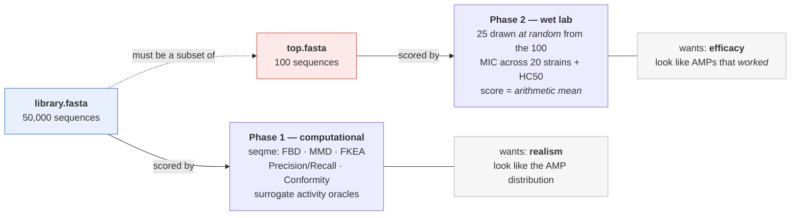
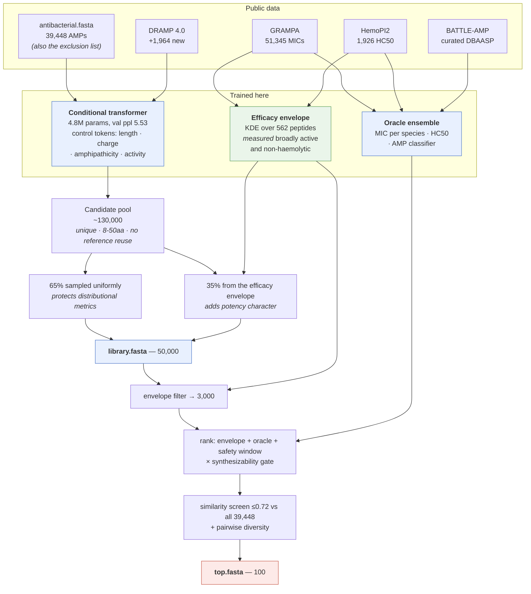

# AMP Challenge 2027 — submission

De novo generative design of linear antimicrobial peptides for the
[AMP Challenge](https://szczurek-lab.github.io/amp-challenge-website/)
(NeurIPS 2026 Competition Track).

## Reproduce the submission

```bash
uv sync
uv run generate
```

Writes:

- `generate/library.fasta` — 50,000 designed peptides
- `generate/top.fasta` — the 100 ranked candidates for wet-lab validation

Both files are byte-identical across runs for the default seed (42).

## Verify compliance locally

```bash
uv run python scripts/selfcheck.py --check-reproducibility
```

Mirrors every check in the organizers' `verify_submission.py`: library size,
alphabet, length bounds, duplicates, top-list membership, zero exact overlap
with `data/antibacterial.fasta`, the exhaustive ≤0.80 Levenshtein-ratio
constraint on the top-100 against all 39,448 references, and byte-level
reproducibility across two runs.

## The shape of the problem

The competition asks for two artefacts, and **scores them with different
things**. Optimising one objective for both is the central trap, and the design
below exists to avoid it.



Because 25 of the 100 are drawn **uniformly at random** and the team score is the
**mean**, a single outstanding peptide is worth nothing — every entry must be
strong, and variance costs as much as a low mean.

## Pipeline



### Why the efficacy envelope exists

Our trained MIC oracle ranks curated-database peptides well (Spearman 0.611
held out) but **failed an external test**: on 46 peptides with MICs measured on
the real competition panel it scored **0.062**. That is field-wide, not local —
QMAP (2026) reports "poor performance for high-potency MIC regression", and
BATTLE-AMP finds activity cliffs unresolved.

So the pipeline leans on a population-level statistic instead, which makes no
per-peptide claim. Taking every GRAMPA peptide measured against four or more
species and keeping those active (≤16 µM) against 80% of them:

| | length | charge | amphipathicity |
|---|---|---|---|
| Measured broadly active | 21 | **+5.0** | **0.47** |
| Measured inactive | 15 | +2.1 | 0.41 |
| Full AMP database | 18 | +3.0 | 0.36 |

The database average sits at the *inactive* end on charge. Optimising toward the
"typical" AMP is therefore not the same as optimising toward an effective one —
and that distinction drives both the library blend and the top-100 filter.

## Method

A conditional autoregressive transformer generates a candidate pool; the library
is assembled as a uniform bulk plus an efficacy-shifted fraction; a trained
oracle ensemble and the efficacy envelope together rank the top-100.

### Generator
A 4.8M-parameter decoder-only transformer (d=256, 6 layers, 8 heads) over the
20-letter amino-acid alphabet, trained on the competition's own antibacterial
reference set plus the non-overlapping portion of DRAMP. Four control tokens are
prepended — length, net charge, amphiphilicity and *activity* buckets — each
independently dropped to a null token during training, which gives
classifier-free guidance at sampling time.

The first three are sampled from the reference AMPs' empirical joint
distribution. Steering them by hand was measured and was worse on every metric:
the AMP charge mode sits near +3, and pushing to +7 moved the library off the
mode rather than onto it.

The activity axis is bucketed by an adversarially-trained AMP classifier's score
on each *training* peptide, so it encodes "how canonically AMP-like is this real
peptide" rather than a feedback loop on the model's own output. That distinction
matters: classifier-guided feedback schemes (FBGAN and descendants) are known to
amplify classifier bias, because the classifier scores sequences the generator
produced. Here the classifier only ever scores real database peptides.

### Library selection
Phase 1 scores four metric families at once, and they pull against each other:
`Diversity`, `FKEA` and `AuthPct` reward spreading out, while `FBD`, `Precision`
and `ConformityScore` reward sitting on the AMP manifold.

The key observation is that these live in *different spaces*. `ConformityScore`
is a typicality statistic over 2-D (amphiphilicity, charge); `FBD`/`Recall`/`FKEA`
are distributional metrics over ESM embeddings. Concentrating in the former does
not require collapsing in the latter. We therefore sample the library without
replacement with probability proportional to `density ** tau`, where density is
the reference-AMP KDE at each candidate's descriptor position, and `tau` is
calibrated against a measured Pareto curve (see `../RESULTS.md`).

An earlier density-stratified rule was discarded: it bought Conformity
(0.58 → 0.77) by wrecking FBD (2.56 → 3.04), FKEA (207 → 164) and Recall
(0.50 → 0.42).

### Top-100 selection
This is what gets synthesised, and the scoring shape drives the design:
25 of the 100 are drawn **uniformly at random** and the team score is the
arithmetic **mean** over that draw. A single outstanding peptide is worth
nothing — every entry has to be strong, and variance costs as much as a low mean.

Four stages: a cheap physicochemical gate over the whole library; the full
oracle panel (10 species × MIC, plus HC50 and the AMP classifier) on the gated
set; an exhaustive similarity screen against the reference database; then greedy
selection with a pairwise-dissimilarity constraint so one wrong modelling
assumption cannot take down the whole batch.

Ranking is on **expected success rate** (P(MIC ≤ 16 µM), averaged over the panel
weighted by strain counts) rather than on minimum predicted MIC, because Success
Rate is what the competition actually scores. Synthesizability multiplies in as
a gate rather than a goal: peptides that fail synthesis or QC are never
retested, so an unsynthesisable candidate is a dead slot in the 25-peptide draw.

### Oracles
Gradient-boosted trees on 261 handcrafted descriptors (composition, global
physicochemical scalars, CTD, sliding-window extremes, terminal-region
composition, Moreau–Broto autocorrelation, reduced-alphabet dipeptides,
amphipathic-run statistics). Handcrafted features rather than protein-LM
embeddings, for three measured reasons documented in `../LITERATURE_REVIEW.md`;
briefly, they are competitive on pMIC regression, they generalise better to
unseen species, and they are exactly reproducible.

All splits are homology-grouped, not random — random row splits inflate AMP
model scores by >10 AUC points.

## Reproducibility engineering

Co-authorship requires that running the script twice produces identical output,
and the organizers regenerate the library on their own machine and compare. Any
sampled or ranked output is a discrete function of floats, so it only reproduces
if those floats agree, and BLAS reduction order varies with CPU vectorisation
width and thread count.

Three measures:

1. **No BLAS in the sensitive paths.** Sliding-window hydrophobic moments, the
   2-D conformity KDE and single-token attention are written as elementwise
   multiply-and-sum. (This also made sampling 2× faster — NumPy dispatches
   batched tiny matmuls as thousands of separate BLAS calls.)
2. **float64 on CPU with quantized logits.** float64 disagreement is ~1e-14;
   quantizing logits to 1e-6 leaves ~8 orders of magnitude of margin. In float32
   it would leave none. All randomness is NumPy PCG64, bit-identical by spec.
3. **Quantized scores with lexicographic tiebreaks**, so sub-ulp differences
   cannot reorder a ranking. `.gitattributes` pins LF so a Windows checkout
   cannot introduce CRLF and break the byte comparison.

## Layout

```
src/amp_design/
  constants.py     competition constraints, taken from verify_submission.py
  fasta.py         FASTA I/O matching the organizers' parser
  descriptors.py   NumPy reimplementation of the modlamp descriptors seqme uses
  features.py      261-descriptor design matrix for the oracles
  neural.py        conditional transformer: torch training, NumPy float64 sampling
  model.py         backoff Markov baseline generator
  filters.py       novelty + 80%-identity screening with exact blocking filters
  scoring.py       conformity density, potency / selectivity / synthesizability
  oracles.py       trained MIC / HC50 / classifier ensemble, panel aggregation
  selection.py     diversity-constrained selection helpers
  pipeline.py      pool -> library -> top-100
  determinism.py   quantization and stable ordering
  generate.py      entry point
scripts/
  train_transformer.py   fit the generator (GPU)
  train_oracles.py       fit the MIC / HC50 / classifier heads
  train_markov.py        fit the baseline generator
  sample_transformer.py  fast GPU sampling, for offline evaluation only
  check_numpy_parity.py  verify the NumPy sampler matches the torch model
  distill_markov.py      distil the transformer into a Markov model
  selfcheck.py           local compliance check
checkpoint/        model weights (committed)
data/              reference AMP database (from the organizers' starter kit)
```

## Training data

Full disclosure, as required for co-authorship eligibility. Everything below is
public and permissively licensed; no proprietary or non-public data is used.

**Generator corpus**
- `data/antibacterial.fasta` — 39,448 antibacterial peptides from the
  competition starter kit, derived from the MarLys AMP database (an aggregation
  of AMPDB, APD, BaAMPs, CAMP, CancerPPD, DBAASP, DRAMP, InverPep, SATPdb,
  dbAMP). CC-0.
- DRAMP 4.0 general set (`dramp.cpu-bioinfor.org`) — 1,964 sequences not
  already present in the above.

**MIC regressor**
- GRAMPA (Witten & Witten 2019, `github.com/zswitten/Antimicrobial-Peptides`) —
  51,345 MIC measurements over 6,760 peptides.
- `szczurek-lab/battleamp-snakemake`, `data/activity/` — the organizing lab's
  curated DBAASP activity tables for *E. coli*, *S. aureus*, *P. aeruginosa*,
  *K. pneumoniae* and *A. baumannii*, plus strain-level MIC tables for
  *E. coli* ATCC 25922 and *S. aureus* ATCC 25923. MIT-licensed.

**HC50 regressor**
- HemoPI2 (`raghavagps/hemopi2`) — 1,926 peptides with experimental HC50
  against mammalian red blood cells.

**Classifier negatives**
- UniProt reviewed peptides 8–50 aa without antimicrobial annotation.
- Synthetic negatives derived from the reference set: shuffled, 5-point-mutated,
  and uniform-random sequences (construction follows OmegAMP).

No sequence from the reference database is reproduced verbatim in the
submission; exact matches are filtered before selection.

## AI-assistant disclosure

Per the competition's use-of-AI-assistants rule, this submission was prepared
with assistance from a large language model (Claude). The human author remains
responsible for all submitted content.

## License

MIT — see `LICENSE`.
